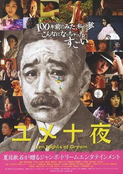
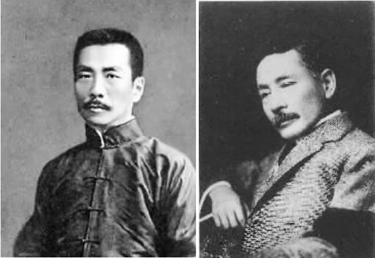
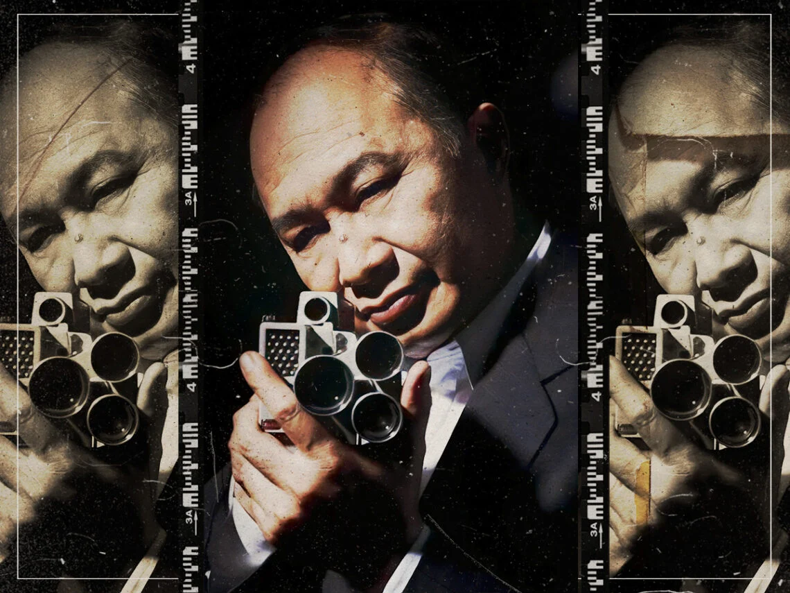
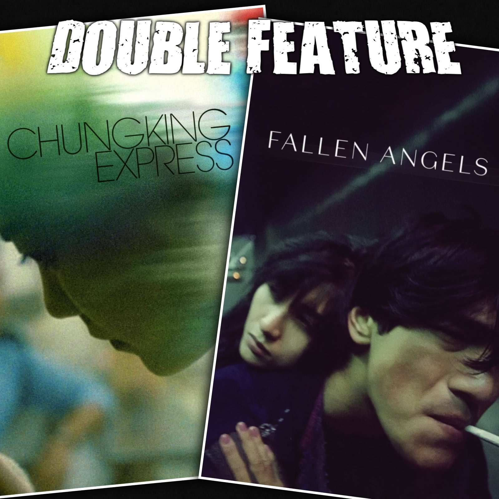

<!-- ## Table of contents
{: .no_toc .text-delta }

1. TOC
{:toc} -->

### Comparative Literature Essays

<table style="width:100%;border:0px;border-spacing:0px;border-collapse:separate;margin-right:auto;margin-left:auto;">
  <tr>
    <td style="padding:2.5%;width:25%;vertical-align:middle;min-width:120px">
      
    </td>
    <td style="padding:2.5%;width:75%;vertical-align:middle">
      <h3>Struggles During Times of Great Change: Natsume Soseki’s Struggle to Seek Identity in “Dream of the Seventh Night”</h3>
      <strong>Jiesen Zhang</strong>
       
      <a href="https://diling69.github.io/assets/pdfs/essays/LTWL_120_ResponsePaper.pdf">Response Paper</a>
      
As a writer who is born and raised during the Meiji period, similar to Lu Xun, Natsume Soseki also witnesses his home country undergoes drastic changes in attempt to modernize and westernize itself. During this period known as Meiji Restoration, Japan embraces western cultures and idea that are fundamentally different from the traditional cultures of Japan. Due to this, Natsume Soseki is not only a great writer in Japanese, but he is also a scholar in English. However, as good as it may sounds, it is not necessarily a blessing. Also similar to Lu Xun, the country and the culture that was once familiar and dear to Natsume is no longer the same as it was. The conflict causes him to question the cultural identity of his country and the identity of himself. In the “Dream of the Seventh Night,” Natsume Soseki portrays his struggle in searching for both Japan’s cultural identity and his own identity as Japanese.

    </td>
  </tr>

  <tr>
    <td style="padding:2.5%;width:25%;vertical-align:middle;min-width:120px">
      
    </td>
    <td style="padding:2.5%;width:75%;vertical-align:middle">
      <h3>Hope Born Out of Despair: Coexistence of Hope and Despair in Works of Lu Xun and Natsume Soseki</h3>
      <strong>Jiesen Zhang</strong>
       
      <a href="https://diling69.github.io/assets/pdfs/essays/LTWL_120_MidtermPaper.pdf">Response Paper</a>
      
Within their lifetime, both Natsume Soseki and Lu Xun witnessed their home country going through drastic changes in an attempt to modernize and Westernize itself. After watching these changes take place, both writers produced works that reflected their attitudes towards the changes themselves and their fellow people. In response to the Meiji Restoration, Natsume Soseki wrote Ten Nights of Dream in 1908. Similarly, Lu Xun wrote the poems of Wild Grass between the years of 1924 to 1926 in response to the end of the New Culture Movement. Both of these works are clouded by a sense of despair, which comes from the writers’ crisis of consciousness. Both Natsume Soseki and Lu Xun felt powerless while going against the trend of their time. As mentioned in the Preface to Call to Arm, both of them are the few that are awake yet feel there’s no hope of destroying the iron house (Lu Xun). However, despair is not all there is to Lu Xun and Natsume Soseki’s work. In spite of the harsh reality that they were facing, neither writer chose to escape into the void of nihilism. Despite everything, there is still hope that is born out of the despair in their works. In “Hope” Lu Xun expresses his worries about the future of China and the numbness of Chinese youth towards national and cultural crisis, while at the same time discuss how to borne hope in the face of despair. In a similar fashion, “The Seventh Night” on the other hand, captures Natsume Soseki’s worries about the future of Japan and the knee-jerking reaction of Japanese people towards Westernization, while at the same time tries to tell the reader why hope is better than despair.

    </td>
  </tr>

  <tr>
    <td style="padding:2.5%;width:25%;vertical-align:middle;min-width:120px">
      
    </td>
    <td style="padding:2.5%;width:75%;vertical-align:middle">
      <h3>Yang and Yin: Contrasting Masculine Archetype in A Better Tomorrow and Chungking Express</h3>
      <strong>Jiesen Zhang</strong>
       
      <a href="https://diling69.github.io/assets/pdfs/essays/LTEA120C_MidtermPaper.pdf">Response Paper</a>
      
Near the end of year 2023, a motivational Chinese beaver took over the internet, inspiring countless people despite the language barrier, as the beaver spoke Chinese and most of the audience did not. It turns out that the clip this animated character is known for is a rendition of a clip from John Woo’s 1986 movie A Better Tomorrow. After nearly 40 years since its debut, A Better Tomorrow continues to affect its audience through a different media, once again connecting them to Mark Lee, one of the main protagonists of the film. Another film that is known for its capability to affect the audience is Wong Kar-wai’s Chungking Express, which is about the lives of four lonely souls seeking love in Hong Kong. Its iconic lines speak out for countless broken hearts even today. While both movies deeply affect their audiences, the male figures are being portrayed in drastically different ways. In A Better Tomorrow, masculinity is portrayed as loyal and unwavering. In contrast, Chungking Express presents a more feminine side of male characters, where masculinity is portrayed as sentimental. These differing portrayals offer a glimpse into the complex society of the city and the instabilities of masculine subjectivity around the hand-over of Hong Kong near the turn of the century.

    </td>
  </tr>

  <tr>
    <td style="padding:2.5%;width:25%;vertical-align:middle;min-width:120px">
      
    </td>
    <td style="padding:2.5%;width:75%;vertical-align:middle">
      <h3>Fallen Angels in the Forest of Hong Kong: The Theme of Rejection in Wong Kar-wai's Cinema</h3>
      <strong>Jiesen Zhang</strong>
       
      <a href="https://diling69.github.io/assets/pdfs/essays/LTEA120C_MidtermPaper.pdf">Response Paper</a>
      
People widely regard Wong Kar-wai’s Days of Being Wild, In the Mood for Love, and 2046 as an informal trilogy, known as the love trilogy or the Su Li-zhen Universe. All of these films share a common character, a woman named Su Li-zhen. However, the character in each film is not the same Su Li-zhen, but the different variations of the same person instead. Though not explicitly connected, Wong Kar-wai implicitly links the different variations through a variety of elements such as the name of the characters and the numbers or items related to that character. This is not the only time that Wong Kai-wai incorporates such element in his films; he also creates another cinematic “universe,” the He Zhiwu Universe, comprising of the movies Chungking Express and Fallen Angels. Both of these films consists of a character named He Zhiwu, played by Takeshi Kaneshiro. Beyond the same name, the two characters are also connected by their relationship to canned pineapple and the number 223.

    </td>
  </tr>
</table>
