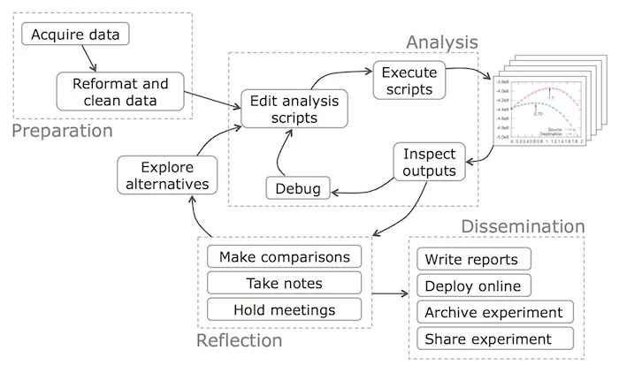
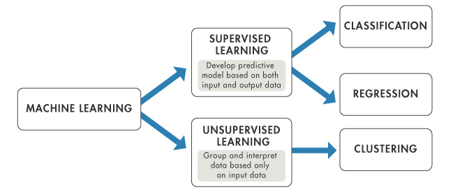

Below is the list detailing the classes that I have served as an undergraduate teaching assistant for at UCSD. Instructors are listed in the order in which I worked with them. Instructor evaluations are attached if available. 

<!-- ### Teaching by Department
{: .no_toc .text-delta }

1. TOC
{:toc} -->

#### Cognitive Science

<table style="width:100%;border:0px;border-spacing:0px;border-collapse:separate;margin-right:auto;margin-left:auto;">

<tr>
    <td style="padding:2.5%;width:25%;vertical-align:middle;min-width:120px">
    
    </td>
    <td style="padding:2.5%;width:75%;vertical-align:middle">
    <h3> Introduction to Data Science</h3>
     
    Prof. Kyle Shannon
     
    <em>UCSD COGS 9  FA22, WI23, SP24</em>
     

     <a href="https://kshannon-ucsd.github.io/cogs9/">website</a>

    

    
The course provides a comprehensive overview of core data science concepts and their applications. Students will delve into data privacy and ethical concerns, illustrated with real-world examples. The course emphasizes identifying pertinent data science questions and selecting the appropriate analytical approaches to address them. Communication skills for data-related topics and projects are honed, along with developing a critical mindset for approaching problems with a 'data-first' perspective. Additionally, the course highlights potential pitfalls in data analyses, teaching students how to identify and avoid them.

    </td>
</tr>

<tr>
    <td style="padding:2.5%;width:25%;vertical-align:middle;min-width:120px">
    
    </td>
    <td style="padding:2.5%;width:75%;vertical-align:middle">
    <h3> Hands-on Computing</h3>
     
    Prof. Kyle Shannon
     
    <em>UCSD COGS 8 FA23</em>
     

    <a href="../assets/pdfs/evaluations/cogs8_eval.pdf">evaluation</a> 

    <a href="https://kshannon-ucsd.github.io/cogs8/">website</a>

    

    
The class explores the fundamental concepts of computing and its applications. Using Python and small microprocessors, students learn to build robotic systems equipped with sensory mechanisms to perform complex tasks. Along the way, the course introduces key concepts within Cognitive Science, particularly embodied, embedded, and distributed cognition.

    </td>
</tr>
</table>

#### Data Science

<table style="width:100%;border:0px;border-spacing:0px;border-collapse:separate;margin-right:auto;margin-left:auto;">

  <tr>
    <td style="padding:2.5%;width:25%;vertical-align:middle;min-width:120px">
      
    </td>
    <td style="padding:2.5%;width:75%;vertical-align:middle">
      <h3>Tutor Apprenticeship in Data Science</h3>
       
      Prof. Colin Jemmott
       
      <em>UCSD DSC 95  WI24</em>
       
      
      <a href="https://dsc-courses.github.io/dsc95-2023-fa/">website</a>
      
      

      
Guide new DSC tutors through their first quarter as a tutor.

    </td>
  </tr>

  <tr>
    <td style="padding:2.5%;width:25%;vertical-align:middle;min-width:120px">
      
    </td>
    <td style="padding:2.5%;width:75%;vertical-align:middle">
      <h3>Theoretical Foundations of Data Science II</h3>
       
      Prof. Justin Elderidge and Dr. Akbar Rafiey
       
      <em>UCSD DSC 40B  FA23 SP24</em>
       
      
      <a href="../assets/pdfs/evaluations/dsc40b_eval.pdf">evaluation</a> 
      
      <a href="https://dsc40b.com">website</a>
      
      

      
DSC 40B, the second course in the sequence, introduces fundamental topics in combinatorics, graph theory, probability, and continuous and discrete algorithms with applications to data analysis.

    </td>
  </tr>

  <tr>
    <td style="padding:2.5%;width:25%;vertical-align:middle;min-width:120px">
      
    </td>
    <td style="padding:2.5%;width:75%;vertical-align:middle">
      <h3>Theoretical Foundations of Data Science I</h3>
       
      Prof. Kyle Shannon
       
      <em>UCSD DSC 40A  SU24</em>
       
      
      <a href="https://dsc40a.com/">website</a>
      
      

      
DSC 40A will introduce fundamental topics in machine learning, statistics, and linear algebra with applications to data analysis.

    </td>
  </tr>

  <tr>
    <td style="padding:2.5%;width:25%;vertical-align:middle;min-width:120px">
      
    </td>
    <td style="padding:2.5%;width:75%;vertical-align:middle">
      <h3>Data Structures and Algorithms for Data Science </h3>
       
      Prof. Suh Young Choi
       
      <em>UCSD DSC 30  SU24</em>
       
      
      <a href="https://catalog.ucsd.edu/courses/DSC.html#dsc30">website</a>
      
      

      
Programming techniques including encapsulation, abstract data types, interfaces, algorithms and complexity, and data structures such as stacks, queues, priority queues, heaps, linked lists, binary trees, binary search trees, and hash tables with Java.

    </td>
  </tr>

</table>